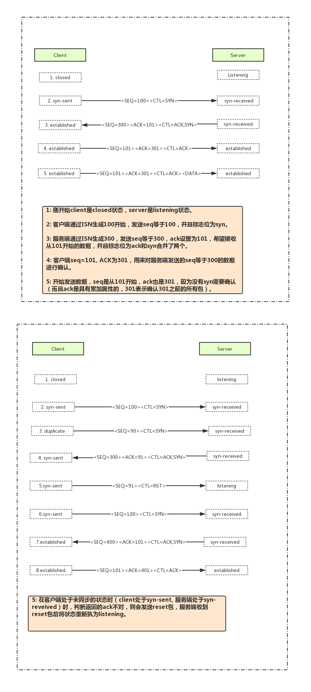

#IO多路复用（事件驱动）
1. 操作系统对外提供一个功能，当某个socket可读或可写时，他会给你个通知。在配合非阻塞socket使用时，只有当系统通知那个描述符可读时，我才去read，可以保证每次read都是读到的有效数据。操作系统为了实现这个功能，对外提供了select/pool/epool这些系统函数，这些函数都能同时监视多个描述符的读写情况，这样多个描述可以在一个线程内交替顺序完成。复用是指复用一个线程。

#TCP/IP协议
1. 四层模型：自上到下分为，应用层（ftp/telnet/http)，传输层（tcp/udp），网络层（ip/arp/rarp），数据链路层。
2. TCP三次握手 : 
		
		刚开始服务端处于listening状态，客户端发送一个syn包给服务端，
		服务端收到这个包后发送一个syn+ack包给客户端，此时服务端状态处于sync_rcvd状态，
		客户端收到后再回给服务端一个ack包确认收到，客户端此时状态更改为established状态，
		服务端收到这个ack包后状态更改为established表明链接建立成功。
		（需要注意的是，为什么最后客户端还要再发送一个ack包，主要原因是
		因为在传输包的过程中可能会由于网络不稳定导致第一次客户端发送的syn没有及时传输到服务端，
		此时客户端由于没有收到服务端的确认信息，则再次发送一个syn包，这次客户端接收到服务端确认信息。此时最开始的syn包也送到服务
		端，服务端再发送一个确认包给服务端，由于此时客户端已经处于established状态会丢弃掉这次确认包，
		所以服务端也不会再收到一次额外的请求)
		
		---------------------------------------------------
		需要明确的事情：TCP可靠性传输是依赖seq num来确定的，因为每个包都有一个序列号，所以可以对每个包进行确认。
		当新建一个TCP链接时会生成一个32位的ISN（初始的序列号）。
		

3. TCP四次挥手：

		四次挥手过程，主动断开的一方叫做客户端。
		客户端的状态FIN_WAIT1->FIN_WAIT2->TIME_WAIT->CLOSED
		服务端状态CLOSE_WAIT->LAST_ACK->CLOSED
		首先客户端发送一个FIN包给客户端，自己处于FIN_WAIT1状态；
		服务端收到FIN包后，返回给客户端一个ACK包，并且关闭读通道，自己处于CLOSE_WAIT状态；
		客户端收到ACK包后，并且关闭写通道，自己处于FIN_WAIT2状态；
		服务端再发送一个FIN包给客户端，自己处于LAST_ACK状态；
		客户端收到FIN包后，返回给服务端一个ACK包，自己处于TIME_WAIT状态；
		服务端收到ACK包后，关闭写通道，自己处于CLOSED状态，即就是关闭链接；
		客户端Client在TIME_WAIT状态下要等待最大数据段生存期的两倍，然后才进入CLOSED状态，TCP协议关闭连接过程彻底结束。

	为什么需要TIME_WAIT
		
		由于time_wait是要等待最大数据段生存期的两倍时间，可以用以保证被重新分配的socket不会受到之前残留的延迟重发报文影响。
		首先TCP协议是全双工，如果客户端不保持close_wait直接关闭，由于网络影响最后的ACK包服务端没有收到，那服务端在超时后又发送一个FIN包给客户端，但是这个时候由于客户端已经closed了，所以会收到一个RST包，这样就不符合TCP协议的可靠性了。
		另外如果客户端直接closed，新链接可能会和老的关闭链接使用的相同端口号，由于网络问题，服务端再发送一个FIN包给客户端，这时候就会导致新链接和老链接数据混淆。所以TCP要在TIME_WAIT等待两倍MSL，等网络上本次链接所有数据都从网络中消失。

		
		
#阻塞非阻塞
	首先阻塞和非阻塞是站在我的角度考虑的。我要等着，或者我不等。
		
		